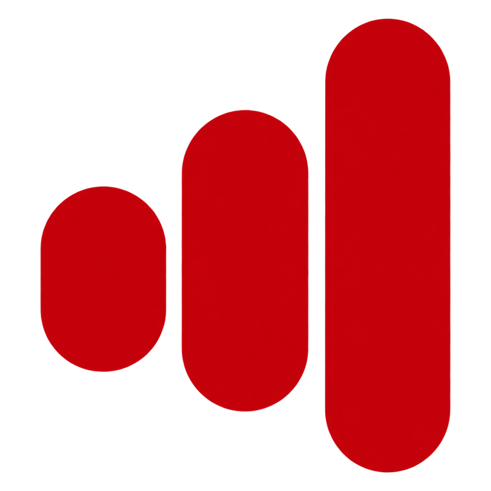
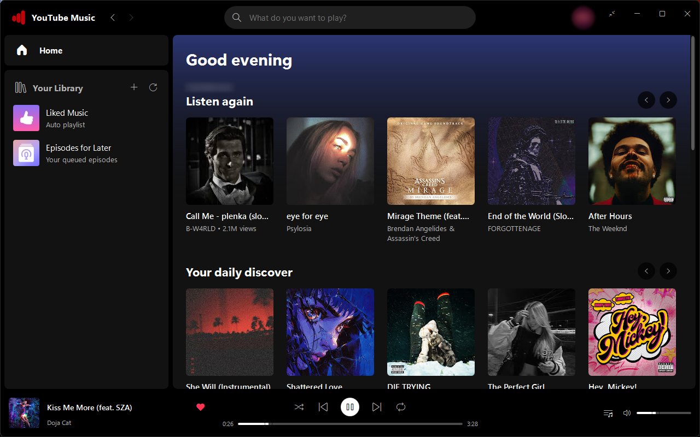
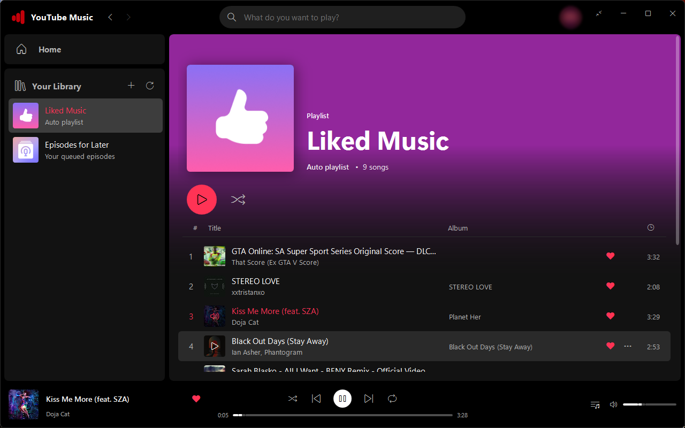
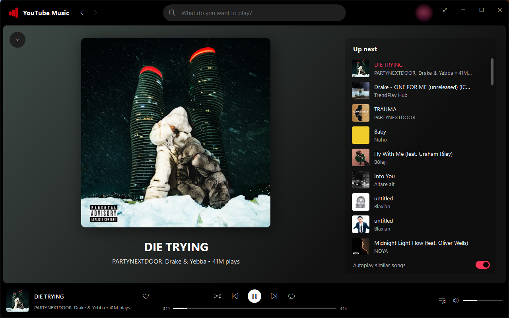
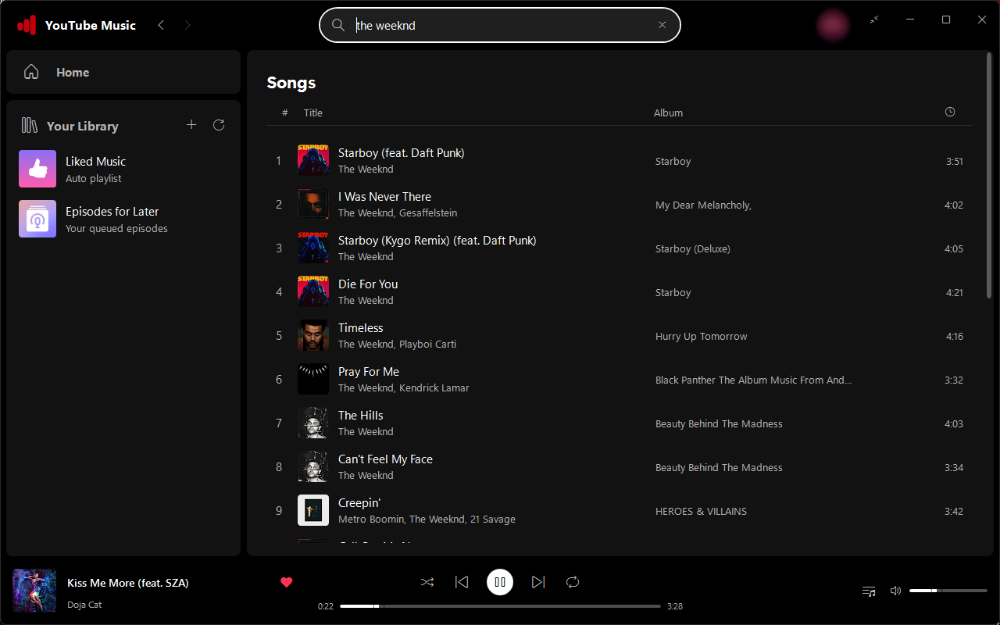
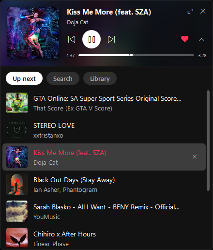

<p align="center">
  
</p>

# YouTube Music Native

A fast, lightweight **native** YouTube Music player for Windows. It doesn't embed a browser and doesn't wrap Electron. The UI is
plain WPF, song data comes straight from YouTube Music's own API, and playback is audio-only through
[libmpv](https://mpv.io) + [yt-dlp](https://github.com/yt-dlp/yt-dlp). A browser tab with YouTube Music open
easily takes 500 MB–1 GB of RAM. This app plays the same music in a fraction of that.



| Playlist (hover a cover to play, click the playing one to pause) | Now Playing |
| --- | --- |
|  |  |

| Search | Mini player with its Up next / Search / Library drawer |
| --- | --- |
|  |  |

## Install

Download **`YouTubeMusicNative-<version>-setup.exe`** from the
[latest release](https://github.com/mybugga/youtube-music-native/releases/latest) and run it.

- It installs for your user only (no admin prompt) into `%LocalAppData%\Programs\YouTubeMusicNative`, adds a
  Start menu entry (and optionally a desktop icon), and can be uninstalled from *Settings → Apps*.
- Nothing else is needed: the .NET runtime, libmpv, yt-dlp and Deno are all included.
- **Updates itself.** The app checks GitHub for new releases every few hours, downloads them in the
  background and installs them quietly the next time it closes or starts. When one is ready, an
  **Update** button also shows up in the title bar to install it right away. Both behaviours can be turned
  off under *Account & settings*. The bundled yt-dlp is kept current too.
- If you'd rather not install anything, there is also a portable `.zip` on each release. The portable copy doesn't
  update itself.

> If your firewall only allows listed programs, allow `YouTubeMusicNative.exe`, `yt-dlp.exe` and
> `deno.exe` in the install folder.

## Features

- **Home** feed (personalised when signed in), live search as you type, recent searches
- Playlist and album pages with an art-tinted header, Play and Shuffle. Hover a song's cover to play it. On
  the current song, the same button pauses and resumes.
- **Now Playing** view: big art, up-next list, background tinted from the album art (click the player bar)
- Queue with autoplay radio, shuffle, and repeat off / all / one
- **Mini player**: compact, always on top. It has a drawer for Up next, Search and Library that hides itself when
  you move away. Drag it to a screen edge and it tucks away to a small cover tab.
- Your library: like songs, create and delete playlists, add songs to playlists and remove them
- **No account needed**: signed out, likes and playlists are kept on this PC (tagged *Local*). Signed in, when you
  create a playlist you choose YouTube Music or this PC.
- Your YouTube playlists are cached, so after signing out (or while YouTube can't be reached) they stay listed and
  playable, tagged *Cached*. **Settings → Clear cache** removes them.
- Picks up where you left off: the last queue, song and position come back on launch
- Media keys and the Windows media overlay, tray icon, close to tray
- Shortcuts: `Space` play/pause, `Ctrl+←/→` previous/next, `Ctrl+F` search, `Ctrl+L` queue, `Alt+←` back,
  `Esc` closes Now Playing

### Signing in

Click the avatar in the title bar and pick a way to sign in:

- **Sign in with your browser** (Firefox, LibreWolf, Waterfox, Floorp, Zen). Google sign-in opens there, and the app
  picks up the session by itself as soon as you're signed in. It refreshes the session on every start.
- **Sign in with Google**: a small sign-in window, for Chrome or Edge users (those browsers encrypt their cookies).
- **Paste a cookie or import cookies.txt**, for advanced users.

Cookies are stored encrypted (DPAPI, your Windows account only) in `%LocalAppData%\YouTubeMusicNative`.

## Keeping it light

- Audio only (`video=no`), with a small 8 MiB mpv demuxer cache
- Thumbnails are fetched and decoded at display size, in a bounded cache
- Virtualized lists, and a workstation non-concurrent GC
- Minimizing to the tray or switching to the mini player releases the main UI tree and compacts the heap

## Building from source

Requires the [.NET 10 SDK](https://dotnet.microsoft.com/download).

```powershell
.\scripts\fetch-deps.ps1                      # libmpv-2.dll, yt-dlp.exe and deno.exe into src/YouTubeMusicNative/deps
dotnet run --project src/YouTubeMusicNative
```

Playback problems? `%LocalAppData%\YouTubeMusicNative\mpv.log` has the mpv and yt-dlp messages from the current session.

## Releasing

Push a version tag and GitHub Actions does the rest:

```powershell
git tag v1.2.0
git push origin v1.2.0
```

[`release.yml`](.github/workflows/release.yml) builds a self-contained publish, the
[Inno Setup](https://jrsoftware.org/isinfo.php) installer ([`installer/`](installer/YouTubeMusicNative.iss)) and the
portable zip. It then publishes them as a GitHub release, and installed copies pick that release up automatically.
To build the same thing locally (with Inno Setup 6 installed), run `.\scripts\build-release.ps1 -Version 1.2.0`.
The output goes to `dist\`.

## Disclaimer

This is an unofficial client. It is not affiliated with, endorsed by, or sponsored by YouTube or Google.
"YouTube" and "YouTube Music" are trademarks of Google LLC. Use it in line with YouTube's Terms of Service.
